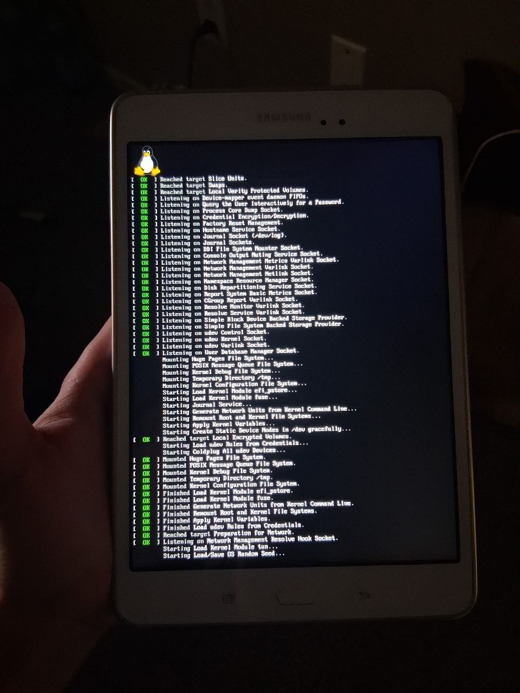
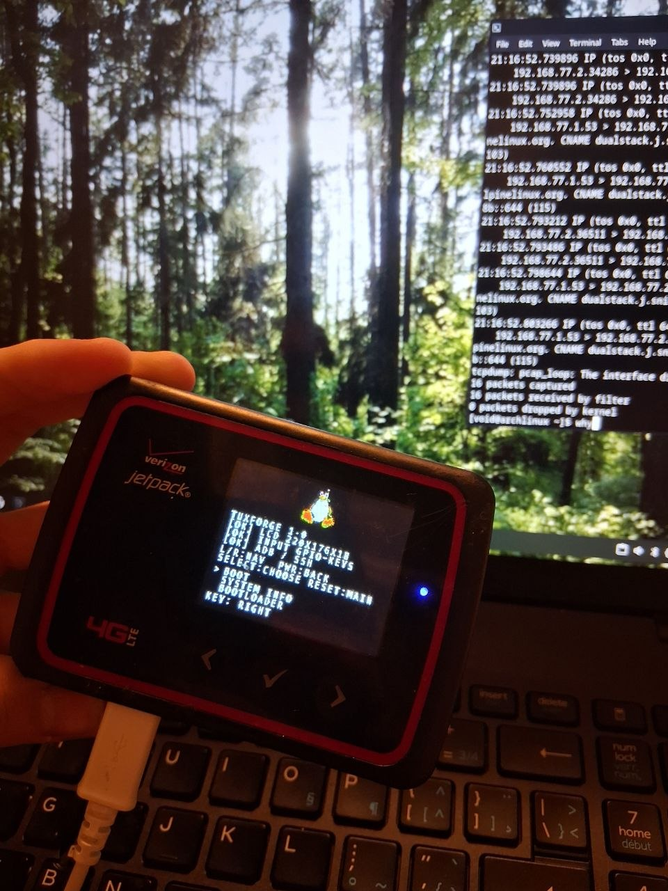

<!-- SPDX-License-Identifier: MPL-2.0 -->

# TuxForge

<p align="center">
  
</p>

<p align="center">
  Open-source Linux development.
</p>

---

## About

**TuxForge** is an open source project focused on Linux, embedded systems,
low level development, and experimenting with hardware.

The goal is to make old hardware give a second life, turning them into Linux computers.

---

### Installation

Boot into fastboot mode, open a terminal, and proceed with the following commands.

## 1. Install the TuxForge root filesystem

Download and extract the TuxForge root filesystem for your device. Recommended with [TWRP](https://twrp.me) or pushing it with ADB and extract the archive file

The root filesystem must be installed to the Linux/root partition used by the TuxForge kernel before attempting to boot Linux.

Follow the root filesystem installation instructions before continuing.

Some devices wouldnt need TuxBerry check the "Devices that are currently supported or under development" section

### 2. Install the TuxForge kernel

Download the image and flash it

```
fastboot flash boot TuxForge-*device*-kernel.img
```

### 3. Install TuxBerry

TuxBerry is the second-stage bootloader used by TuxForge.

First, test TuxBerry without flashing it:

```sh
fastboot boot TuxBerry-v1.0-*device*.img
```

If TuxBerry boots correctly, flash it:

```sh
fastboot flash boot TuxBerry-v1.0-*device*.img
```

Then reboot:

```sh
fastboot reboot
```

### 4. Boot TuxForge

TuxBerry will start and display its boot menu.

Controls:

- **Volume Up** — move through the menu
- **Home** — select

Select:

```text
BOOT LINUX or BOOT
```

TuxBerry will load the TuxForge Linux kernel and start Linux.

See the [TuxBerry repository](https://github.com/tuxwalk/TuxBerry) for bootloader and device specific information.

## Gallery

<p align="center">
  
  
</p>

---

## Devices that are currently supported or under development:

-- Novatel Mifi 6620L (Supported, does not need second stage bring up like TuxBerry, flash it in the boot partition)

-- Redmi Note 5/5 Pro, whyred (currently under development locally)

-- Samsung Galaxy Tab A 8.0, gt58wifi (2015) (Supported)

P.S, all of these devices use ADB interface

## Support TuxForge

Want to support its development? You can help
fund hardware and development

<a href="https://www.buymeacoffee.com/tuxforge">
  
</a>

Thank you for supporting TuxForge!

---

## lk2nd

lk2nd is no longer supported by TuxForge.

---

## Contributing

Contributions, testing, ideas, bug reports, and documentation improvements
are welcome.

Open an issue or submit a pull request and I will help you with whatevers bothering you.

## License

TuxForge uses multiple open-source licenses depending on the component.

### TuxForge Code — MPL-2.0

Original TuxForge source code, device support code, and other project components are licensed under the **Mozilla Public License 2.0 (MPL-2.0)** unless otherwise stated.

See [`LICENSE`](LICENSE) for the full MPL-2.0 license.

### Scripts — MIT

Original TuxForge build scripts, helper scripts, and utilities are licensed under the **MIT License** unless otherwise stated.

See [`LICENSES/MIT.txt`](LICENSES/MIT.txt).

### Linux Kernel and Upstream Code

Code derived from the Linux kernel or other upstream projects remains under its original license.

Existing copyright notices and SPDX license identifiers are preserved and take precedence over the general TuxForge licensing terms.

### Firmware and Third-Party Components

Firmware, binary blobs, drivers, source code, and other materials originating from third parties remain subject to their respective licenses and redistribution terms.

TuxForge does not claim ownership of third-party components.

## License

See [LICENSE](LICENSE) for licensing information.
